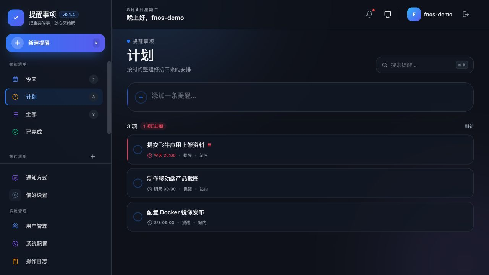
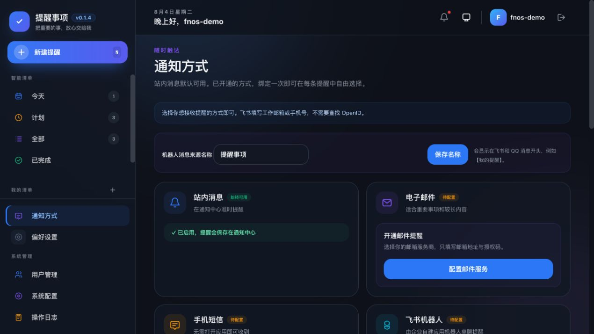
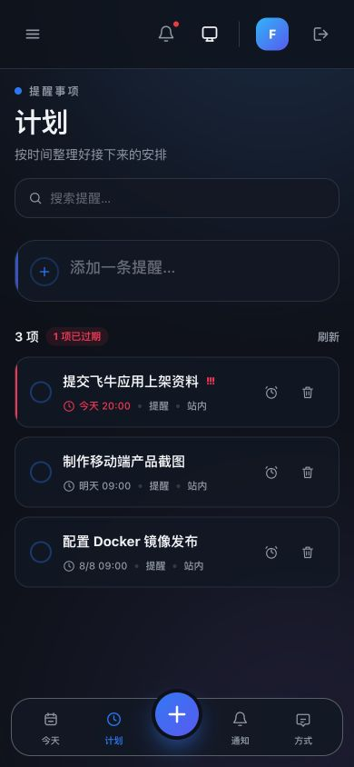
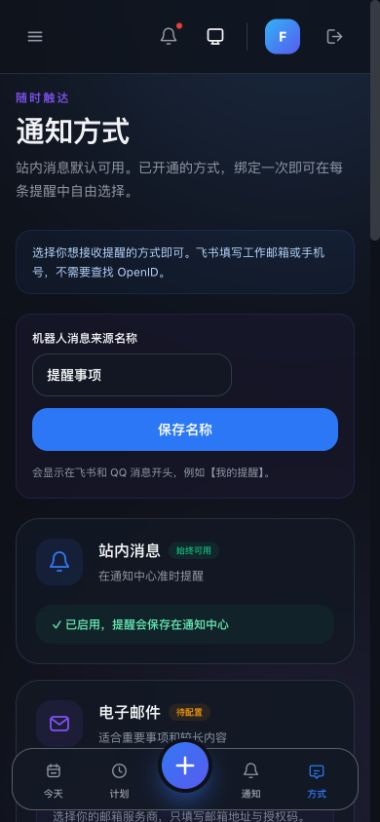

# Reminder

面向中国大陆用户的轻量多渠道提醒应用。界面借鉴移动端提醒工具的低学习成本，支持清单、
今天/计划/全部/已完成视图、重复提醒、稍后提醒，以及站内、邮件、短信、飞书、QQ 和钉钉通知。

版本功能与修复记录见 [CHANGELOG.md](./CHANGELOG.md)。

如果这个项目对你有帮助，欢迎[支持作者](#支持作者)，微信收款码见文末。

## 界面预览

| PC 端：计划视图 | PC 端：通知方式 |
| --- | --- |
|  |  |

| 手机端：计划视图 | 手机端：通知方式 |
| --- | --- |
|  |  |

## 技术栈

- Go + Gin + GORM + SQLite（WAL）
- Vue 3 + TypeScript + Pinia + Vue Router
- Tailwind CSS + Vite

## 本地开发

要求 Go 1.26+、Node.js 20+、CGO 和本地 C 编译器。

```bash
# 构建 Vue 前端、复制到后端静态目录、构建并启动 Go 后端
make dev
```

浏览器访问 `http://localhost:8906`。开发模式只启动 Go 后端一个服务，API 和前端页面
共用 8906 端口；首次运行会自动安装前端依赖。可通过 `PORT=9000 make dev` 临时改端口。

需要邮件、短信、飞书或 QQ 时，先复制 `.env.example` 为 `.env`，填入相应服务端凭证，再运行
`make dev`。`.env` 会在本地启动时自动读取，且不会覆盖已经设置的系统环境变量。

仅构建或启动已构建产物：

```bash
make build
make start
```

首次注册的用户自动成为管理员。

## 核心能力

- 默认清单和自定义清单；
- 今天、计划、全部、已完成智能视图；
- 快捷新增、编辑、删除、完成、恢复；
- 每天、每周、每月、每年重复；
- 稍后 10 分钟提醒；
- 持久化投递任务、幂等领取、失败分类和最多三次重试；
- 站内通知中心；
- SMTP 邮件；
- 可配置短信 HTTP 网关；
- 飞书企业自建应用机器人单聊；
- QQ 机器人主动单聊；
- 钉钉个人群自定义机器人；
- 浅色/深色主题和响应式手机界面。

## 外部渠道配置

```text
# 邮件
SMTP_HOST
SMTP_PORT
SMTP_USERNAME
SMTP_PASSWORD
SMTP_FROM_NAME
SMTP_FROM_ADDRESS

# 短信 HTTP 网关
SMS_WEBHOOK_URL
SMS_WEBHOOK_TOKEN

# 飞书
FEISHU_APP_ID
FEISHU_APP_SECRET
FEISHU_BASE_URL

# QQ
QQ_BOT_APP_ID
QQ_BOT_APP_SECRET
QQ_BOT_API_BASE

# 可选：单独的数据加密密钥
REMINDER_DATA_KEY
```

渠道接收目标在数据库中使用 AES-GCM 加密。未设置 `REMINDER_DATA_KEY` 时，会从安装实例的
内部 JWT 密钥派生独立加密密钥。

## 在线统计与赞赏支持

应用内置与家族其他应用一致的「匿名使用统计 + 赞赏支持」能力（上报地址
`https://techfunway.wycto.cn/api/apps.online/refresh`）：

- **匿名透明**：每 60 分钟一次心跳，只上报设备级信息——哈希后的设备标识
  （`data/device.id`，卸载重装应用不变、重装系统才变）、操作系统、架构、部署形态
  与应用版本。不含用户名、主机名、提醒内容或 IP 明文。
- **赞赏完全自愿**：管理员在控制台的弹窗、顶部横幅与「偏好设置」卡片可看到赞赏入口；
  点击「已支持」后在弹窗内填写金额（可选，仅接收端统计用、不做支付核验），随后向统计
  端点发送一次匿名 `donate_support` 计数（携带 `amount` 金额字段）；**不支付不影响任何功能**。
  支持记录按版本号记忆，应用升级到新版本后会再次提示。
- **可退出**：以下任一方式可完全关闭统计上报：
  - 启动参数 `-disable-stats`；
  - 环境变量 `DISABLE_STATS=1`；
  - 管理员在「系统配置」中关闭 `stats_enabled`（运行时生效）。

`DEVICE_TYPE`（`-device-type`）用于标识部署形态（`fnos`/`docker`），仅参与统计的平台
分布；`STATS_ENDPOINT` 环境变量可覆盖上报地址（本地测试用）。

如果应用帮到了你，欢迎微信扫码请作者喝杯咖啡——金额随意，1 元也是心意，收款码见文末
[支持作者](#支持作者)。

### 钉钉个人提醒

无需创建钉钉应用，也无需配置服务器环境变量。请使用 Windows 或 Mac 的钉钉电脑端操作；手机端不能
创建或配置此机器人：

1. 新建一个专用提醒群，或打开一个现有群。
2. 如果不希望其他人看到提醒，请让群内只保留自己：可新建个人群，或将其他成员移出。
3. 打开群设置，进入“群机器人 / 机器人”，添加“自定义机器人”。
4. 安全设置选择“自定义关键词”，填写 `提醒`，复制 Webhook 地址。
5. 在应用的“通知方式 → 钉钉群机器人”粘贴 Webhook，并发送测试。

提醒会发送给该群的所有当前成员；群内只有你一人时，只有你能收到。每位用户的 Webhook 独立加密保存；
应用只接受钉钉官方机器人地址。

## 运行日志

运行日志默认仅写入 `<data-dir>/logs/`，按日期和级别分为 `info-YYYY-MM-DD.log`、
`warn-YYYY-MM-DD.log`、`error-YYYY-MM-DD.log` 与 `audit-YYYY-MM-DD.log`，默认保留 30 天。
这避免通知通道或后台任务的重复错误刷屏终端；需要排查时可直接查看对应文件。仅本地调试时可使用
`-log-console` 或 `LOG_CONSOLE=true` 同时输出到终端。

## 构建与测试

```bash
cd server && go test ./...
cd web && npm run build
make build
```

### 发布打包

```bash
# 仅编译并打包飞牛 fnOS：生成 x86、ARM 两份 .fpk，不构建 Docker 镜像
make package PACKAGE_TARGET=fnos

# 所有桌面/服务器平台压缩包
make package PACKAGE_TARGET=apps

# 仅构建本地 Docker 镜像（按需执行）
make package PACKAGE_TARGET=docker
```

`PACKAGE_TARGET=fnos` 会使用临时 Linux 编译容器生成 SQLite/CGO 二进制，但不会执行
`docker build`、不会创建镜像标签，也不会推送镜像。

完整产品与技术设计见 [docs/README.md](./docs/README.md)，接口见 [API.md](./API.md)。

## 支持作者

如果 Reminder 帮到了你，欢迎微信扫码请作者喝杯咖啡——金额随意，1 元也是心意：

<p align="center">
  
</p>

收款码也可以在应用内「弹窗、顶部横幅或偏好设置的赞赏入口」查看；支持完全自愿，不影响任何功能。
